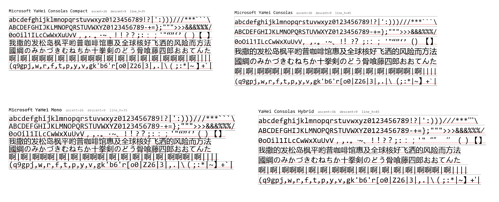

# Microsoft YaHei Consolas Compact — 字体修改说明

本文档说明对 `Microsoft YaHei Consolas` 的修改目的、方案、明细与验证结果。

---

## 1. 背景与目的

[原字体](https://github.com/byzod/Microsoft-Yahei-Consolas)是 Consolas（西文等宽）与微软雅黑（CJK）的合并字体，中英文宽度比例为 **1:2**（半角 advance = 1024，全角 advance = 2048，unitsPerEm = 2048）。

> 原字体修改自[Microsoft-Yahei-Mono](https://github.com/chenyium/Microsoft-Yahei-Mono)，一切版权归原作者……不对，归微软所有🥵
> 很多人都没注意consolas的字宽是1126，而雅黑全宽字是2048

存在的问题：**行高明显高于原版英文字体 Consolas**，中文混排时行距过大，与西文编辑体验不一致。

修改目标：

- 行高降至与原版 Consolas 一致（**2398 = 1.171em**）；
- 保持中文/英文宽度严格 **1:2**；
- 中文字形等比缩小并居中，任何渲染路径下**零裁剪**；
- 半角（Consolas）字形完全不动。

最终效果：


---

## 2. 原字体的问题分析

### 2.1 行高为什么比原版 Consolas 高

原合并字体整套垂直度量（`hhea` / `OS/2` / `head`）直接沿用了**微软雅黑**的数值，而不是 Consolas 的：

| 度量                             | 原版 Consolas                 | 原合并字体          | 修改后             |
| -------------------------------- | ----------------------------- | ------------------- | ------------------ |
| hhea.ascent / descent / lineGap  | 1521 / −527 / 350             | **2167 / −536 / 0** | 1521 / −527 / 350  |
| hhea 行高                        | **2398 (1.171em)**            | **2703 (1.320em)**  | **2398 (1.171em)** |
| OS/2 sTypoAscender/Descender/Gap | 1521 / −527 / 350             | 1663 / −519 / 9     | 1521 / −527 / 350  |
| OS/2 usWinAscent / usWinDescent  | 1884 / 514                    | **2167 / 536**      | 1884 / 514         |
| fsSelection                      | 0x0040（无 USE_TYPO_METRICS） | 同左                | 同左               |

两个字体均未设置 `USE_TYPO_METRICS`，因此 Windows GDI、终端、多数编辑器按 `usWinAscent + usWinDescent`（或 hhea）排版：

- 原版 Consolas 行高 = 1884 + 514 = **2398**；
- 原合并字体行高 = 2167 + 536 = **2703**，**高出 305 单位 ≈ 12.7%**。

**为什么必须用这么大的度量？** 雅黑 CJK 字形垂直范围是 **−521 … 2108**（全角方块设计，占满 em 盒；`中` 为 −277…1707，最高字形达 2108）。若沿用 Consolas 的 winAscent = 1884，最高 2108 的字形顶部会被裁掉 224 单位（≈0.11em）。雅黑把 winAscent 定为 2167（> 2108）正是为了保证不裁剪。因此"中文不被裁剪"与"行高紧凑"必须取其一，原字体选择了前者。

### 2.2 宽度比例（1:2 正常）

拉丁字形 advance = 1024（半宽），CJK = 2048（全宽），比例正确，无需修改宽度。

---

## 3. 修改方案

1. **等比缩放全部全角（雅黑）字形**：按比例 0.9121 缩小，横向居中到全角格；
2. **垂直度量改回原版 Consolas 数值**，使行高 = 2398；
3. **删除失效的 hinting 与竖排表**；
4. **重命名字体族**，避免与已安装的同名字体冲突。

---

## 4. 修改明细

### 4.1 字形缩放

- 缩放对象：advance = 2048 的全角字形，共 **28,874 个**（总字形 31,450，半角字形不动）；
- 缩放前全角字形垂直范围：**[−521, 2108]**；
- 缩放比例：**s = 2398 / 2629 ≈ 0.912134**（等比，横纵同比例）；
- 垂直位移：**dy = −38.778**（线性映射 y′ = s·y + dy，把 [−521, 2108] 映射到 **[−514, 1884]**）；
- 横向：以字形原中心为锚等比缩放后平移居中，`dx = 1024 − s·cx`，使字形在 0–2048 全角格内左右对称；
- advance 宽度保持 2048 不变，**1:2 宽度比不受影响**；
- 半角（Consolas）字形（如 A、g、标点）坐标**逐点不变**。

示例：`中`

|        | 原字体       | 修改后                      |
| ------ | ------------ | --------------------------- |
| x 范围 | [168, 1888]  | [240, 1808]（左右对称留白） |
| y 范围 | [−277, 1707] | [−291, 1518]                |

### 4.2 垂直度量（改为原版 Consolas 数值）

| 表   | 字段                                          | 原值            | 新值                  |
| ---- | --------------------------------------------- | --------------- | --------------------- |
| hhea | ascent / descent / lineGap                    | 2167 / −536 / 0 | **1521 / −527 / 350** |
| OS/2 | sTypoAscender / sTypoDescender / sTypoLineGap | 1663 / −519 / 9 | **1521 / −527 / 350** |
| OS/2 | usWinAscent / usWinDescent                    | 2167 / 536      | **1884 / 514**        |
| head | yMin / yMax（重算）                           | −648 / 2108     | **−648 / 2036**       |
| head | xMin / xMax（重算）                           | −936 / 2050     | **−936 / 1961**       |

修改后行高 = 1521 + 527 + 350 = **2398（1.171em）**，与原版 Consolas 完全一致。

### 4.3 删除的表与指令

| 项目                                               | 原因                                                                  |
| -------------------------------------------------- | --------------------------------------------------------------------- |
| `fpgm` / `prep` / `cvt`（字体级 TrueType hinting） | 指令基于原坐标编译，缩放后失效                                        |
| 全部字形的 hinting 指令（`program`）               | 同上；含 28,874 个缩放字形（重建时丢弃）及 176 个半角字形（主动清除） |
| `vhea` / `vmtx`（雅黑竖排度量）                    | 缩放后坐标错位；原版 Consolas 无此表，终端场景用不到                  |

### 4.4 字体命名

| 字段                        | 原值                             | 新值                                     |
| --------------------------- | -------------------------------- | ---------------------------------------- |
| family / typographic family | Microsoft YaHei Consolas         | **Microsoft YaHei Consolas Compact**     |
| full name                   | Microsoft YaHei Consolas Regular | Microsoft YaHei Consolas Compact Regular |
| postscript name             | —                                | MicrosoftYaHeiConsolasCompact            |

改名是为了避免与系统中已安装的同名（family）字体冲突。

---

## 5. 验证结果

| 验证项                              | 原合并字体     | 修改后                           | 原版 Consolas  |
| ----------------------------------- | -------------- | -------------------------------- | -------------- |
| 行高（hhea / win）                  | 2703 (1.320em) | **2398 (1.171em)**               | 2398 (1.171em) |
| 34px 字号下实际行高（PIL/FreeType） | 45px           | **35px**                         | 35px           |
| 中文/英文宽度比                     | 2.000          | **2.000**                        | —              |
| 全角字形 y 范围                     | [−521, 2108]   | **[−514, 1884]**（win 内零裁剪） | —              |
| 半角字形                            | —              | 未改动                           | —              |

### 文件大小变化

- 19,237,156 字节 → 8,618,108 字节（−55%）；
- 差异几乎全部来自 `glyf` 表（18.77MB → 8.30MB，−10.48MB）；
- 其中 **≈9.91MB 是雅黑字形自带的 TrueType hinting 指令**（28,848 个字形带指令，平均 330 字节/字形）在重建时被丢弃；
- 其余来自删除 `vmtx`（−123KB）、`fpgm`/`prep`/`cvt`（−4.3KB）。

文件变小是"去除 hinting"的必然副作用，而非刻意压缩。

---

## 6. 已知影响与注意事项

1. **hinting 已全部移除**：传统 GDI 渲染下极低字号（<14px）边缘锐利度可能略降；现代渲染（DirectWrite ClearType、FreeType autohint、macOS CoreText）无感知差异。
2. **52 个半角特殊符号**（如框线字符 U+2589 等）仍超出 winAscent/Descent 范围——原字体即如此，原版 Consolas 亦有类似情况，属正常行为，未处理。
3. **安装方法**：将 `Microsoft YaHei Consolas Compact.ttf` 复制到 `~/.local/share/fonts/`（或 `/usr/share/fonts/`），执行 `fc-cache -f`，然后在应用中选择字体族 **Microsoft YaHei Consolas Compact**。

---

## 7. 相关文件清单

| 文件                                   | 说明                                                  |
| -------------------------------------- | ----------------------------------------------------- |
| `Microsoft YaHei Consolas Compact.ttf` | 修改后的字体（最终交付）                              |
| `Microsoft YaHei Consolas Regular.ttf` | 原始合并字体（未改动，保留备份）                      |
| `build_compact_font.py`                | 可复现的构建脚本（从原字体生成修改后字体）            |
| `compare_lineheight.png`               | 字体行高对比图 |

---

## 8. 重新生成方法

`build_compact_font.py` 是完整的可复现构建脚本，从原始字体一步生成修改后字体：

```bash
pip install fonttools        # 依赖（4.x）
python3 build_compact_font.py "Microsoft YaHei Consolas Compact.ttf"
# 或省略参数，默认输出同名文件
```

脚本按以下顺序处理（与本文档第 4 节一致）：

1. 按 advance = 2048 划分全角（雅黑）字形；
2. 计算全局变换参数（s = 0.912134，dy = −38.778）；
3. **先展平全部复合字形为简单字形**（消除组件/复合字形的处理顺序依赖，保证确定性）；
4. 逐字形等比缩放 + 横向居中，更新 hmtx 的 lsb；
5. 重算 head 全局边界；
6. 垂直度量改回原版 Consolas（行高 2398）；
7. 删除 `fpgm`/`prep`/`cvt`/`vhea`/`vmtx`；
8. 清除全部字形 hinting 指令；
9. `maxp` 重算；
10. 重命名 family 为 `Microsoft YaHei Consolas Compact`。

两次独立运行输出逐字节一致（除 `head.modified` 保存时间戳），构建结果可复现、可审计。

---

## 9. 附：Zed 编辑器配置

Zed 中**多个 `font_family` 字段相互独立**，需要逐一改成新字体，否则对应区域的中文会 fallback 到系统 CJK 字体（如 Noto Sans CJK SC），其全角宽度对 Consolas 英文约为 **1.82 个英文宽度**，表现为"中文比 2 个英文窄"。

需要修改的字段：

| 字段                    | 作用                         | 是否必改                                |
| ----------------------- | ---------------------------- | --------------------------------------- |
| `buffer_font_family`    | 代码编辑区字体               | **必改**（最常见的问题来源）            |
| `terminal.font_family`  | 终端面板字体                 | **必改**（与编辑区独立）                |
| `ui_font_family`        | 界面（侧栏、面板、菜单）字体 | 可选；默认跟随系统，一般无需修改        |
| `buffer_font_fallbacks` | 编辑区回退字体列表           | 可选；本字体自含全部 CJK 字形，无需配置 |

参考写法（在 `~/.config/zed/settings.json` 中按需添加/修改）：

```jsonc
{
    "buffer_font_family": "Microsoft YaHei Consolas Compact",
    "terminal": {
        "font_family": "Microsoft YaHei Consolas Compact",
    },
}
```

保存后 Zed 会自动重载设置；若未生效请重启 Zed。只改了 `terminal.font_family` 而漏改 `buffer_font_family`，是"编辑区中文宽度不正确"最常见的原因。

---

_文档生成时间：2026-08-12。修改工具：fontTools 4.61.0。_
